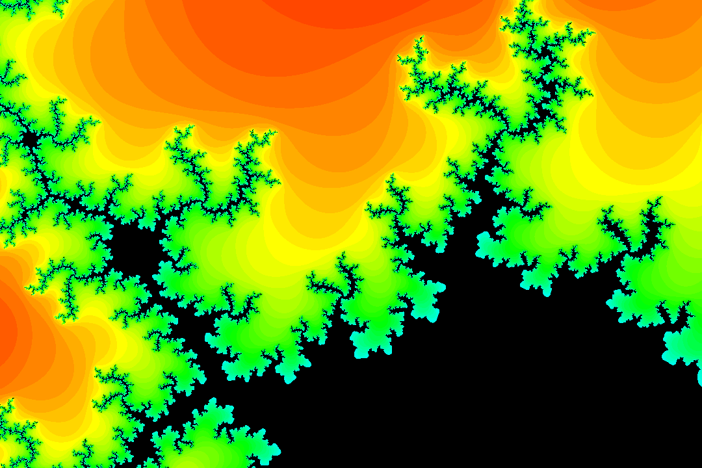

# Mandelbrot Visualization in Elixir
> The project was done for a course in functional programming at KTH. It is completely written in Elixir, a functional language.

The Mandelbrot set is a set of complex numbers received from iterating a function until convergence. It is often visualized with hypnotic zooming that dives infinitely deep into the set. The project is entirely written in Elixir, a functional programming language based on Erlang. 


<p align="center">
  
</p>

## Usage example
To create a simple picture of the Mandelbrot set run the following command.

```sh
elixir mandelgif.ex
```

## Development setup

Elixir is required to run the project.


## Meta

Erik Båvenstrand – [Portfolio](https://bavenstrand.se) – erik@bavenstrand.se

Distributed under the MIT license. See ``LICENSE`` for more information.

[github.com/ErikBavenstrand](https://github.com/ErikBavenstrand)
